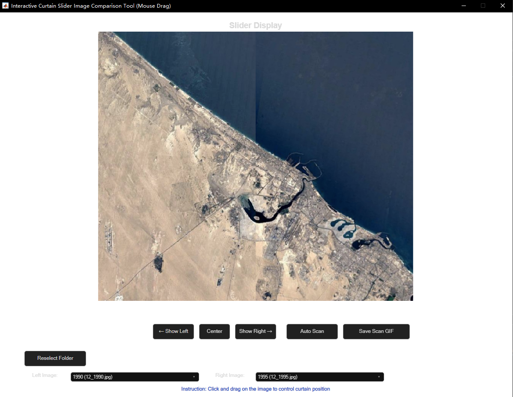
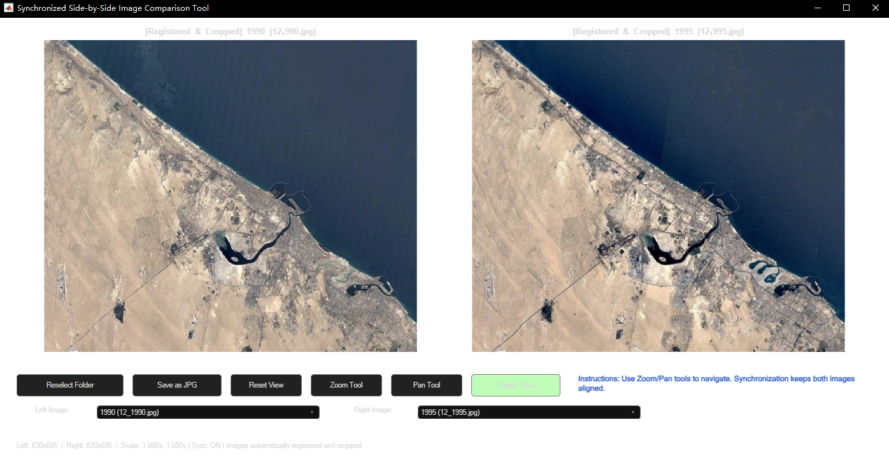
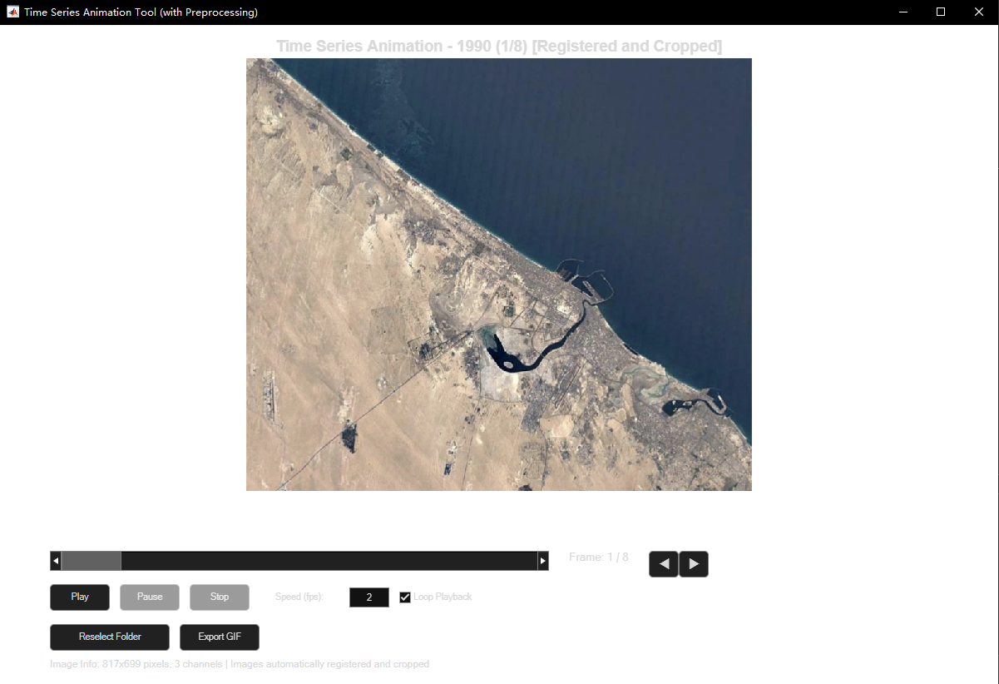

# EarthViewer GUI - Display Modules Integration Guide

## 📋 Overview

This document provides integration guidelines for three standalone display modules designed for the EarthViewer GUI application. Each module handles specific image comparison and visualization tasks with comprehensive user interfaces.

## 🚀 Modules Overview

| Module | Purpose | Key Features |
|--------|---------|--------------|
| **Curtain Slider** | Interactive curtain-style comparison | Mouse drag control, Auto scan, GIF export |
| **Side-by-Side** | Synchronized dual-view comparison | Coordinated zoom/pan, Export combined image |
| **Timelapse Animation** | Time series animation player | Video controls, Adjustable speed, GIF export |

---
### 1. Curtain Slider View (`curtainSliderDisplay.m`)

#### **Visual Example**



#### **Integration Requirements**

**🎯 Target Tab**: `SliderViewTab`

**📦 Required UI Components**:

```matlab
% Position Control Buttons
uicontrol('Style', 'pushbutton', 'String', '← Show Left', ...
    'Callback', @(src,evt) resetPosition('left'));
uicontrol('Style', 'pushbutton', 'String', 'Center', ...
    'Callback', @(src,evt) resetPosition('center'));
uicontrol('Style', 'pushbutton', 'String', 'Show Right →', ...
    'Callback', @(src,evt) resetPosition('right'));

% Main Function Buttons
uicontrol('Style', 'pushbutton', 'String', 'Auto Scan', ...
    'Callback', @autoScanCallback);
uicontrol('Style', 'pushbutton', 'String', 'Save Scan GIF', ...
    'Callback', @saveAutoScanGIF);

```

**🔧 Core Functions**:
- `resetPosition(position)` - Quick position control ('left'|'center'|'right')
- `autoScanCallback()` - Animated curtain scanning
- `saveAutoScanGIF()` - Export scan animation as GIF
- `mouseDownCallback()` - Handle mouse drag start
- `mouseMoveCallback()` - Update curtain position during drag

**📞 Integration Call**:
```matlab
% From SliderViewTab activation
curtainSliderDisplay(app.CroppedImages{startIdx}, app.CroppedImages{endIdx}, titles);
```

---

### 2. Side-by-Side Display (`sideBySideDisplay.m`)

#### **Visual Example**



#### **Integration Requirements**

**🎯 Target Tab**: `DifferenceHighlightTab` or custom comparison tab

**📦 Required UI Components**:

```matlab
% View Control Buttons
uicontrol('Style', 'pushbutton', 'String', 'Reset View', ...
    'Callback', @resetView);
uicontrol('Style', 'pushbutton', 'String', 'Zoom Tool', ...
    'Callback', @enableZoom);
uicontrol('Style', 'pushbutton', 'String', 'Pan Tool', ...
    'Callback', @enablePan);

% Sync Control
app.sync_button = uicontrol('Style', 'pushbutton', 'String', 'Toggle Sync', ...
    'Callback', @toggleSync, 'BackgroundColor', [0.7, 1.0, 0.7]);

% Export Button
uicontrol('Style', 'pushbutton', 'String', 'Save as JPG', ...
    'Callback', @saveImage);

% Dual Display Areas
app.left_axes = axes('Position', [left_position]);
app.right_axes = axes('Position', [right_position]);
```

**🔧 Core Functions**:
- `resetView()` - Reset both panels to original view
- `enableZoom()` - Activate zoom tool for both panels
- `enablePan()` - Activate pan tool for both panels  
- `toggleSync()` - Enable/disable synchronization
- `saveImage()` - Export combined side-by-side image
- `syncFromLeft()` - Synchronize right panel with left
- `syncFromRight()` - Synchronize left panel with right

**📞 Integration Call**:
```matlab
% From any comparison tab
sideBySideDisplay(app.CroppedImages{leftIdx}, app.CroppedImages{rightIdx}, titles);
```

---

### 3. Timelapse Animation (`timelapseAnimation.m`)

#### **Visual Example**



#### **Integration Requirements**

**🎯 Target Tab**: `TimelapseTab`

**📦 Required UI Components**:

```matlab
% Playback Controls
app.play_button = uicontrol('Style', 'pushbutton', 'String', 'Play', ...
    'Callback', @playCallback);
app.pause_button = uicontrol('Style', 'pushbutton', 'String', 'Pause', ...
    'Callback', @pauseCallback, 'Enable', 'off');
app.stop_button = uicontrol('Style', 'pushbutton', 'String', 'Stop', ...
    'Callback', @stopCallback, 'Enable', 'off');

% Frame Navigation
uicontrol('Style', 'pushbutton', 'String', '◀', ...
    'Callback', @(~,~) prevFrame());
uicontrol('Style', 'pushbutton', 'String', '▶', ...
    'Callback', @(~,~) nextFrame());

% Speed & Loop Controls
uicontrol('Style', 'text', 'String', 'Speed (fps):');
app.speed_edit = uicontrol('Style', 'edit', 'String', '2', ...
    'Callback', @speedCallback);
app.loop_checkbox = uicontrol('Style', 'checkbox', 'String', 'Loop Playback', ...
    'Value', 1);

% Frame Slider
app.frame_slider = uicontrol('Style', 'slider', 'Min', 1, 'Max', numFrames, ...
    'Callback', @frameSliderCallback);
app.frame_text = uicontrol('Style', 'text', 'String', 'Frame: 1 / N');

% Export Controls
uicontrol('Style', 'pushbutton', 'String', 'Export GIF', ...
    'Callback', @exportGIF);
```

**🔧 Core Functions**:
- `playCallback()` - Start animation playback
- `pauseCallback()` - Pause current playback
- `stopCallback()` - Stop and reset to first frame
- `prevFrame()` / `nextFrame()` - Manual frame navigation
- `speedCallback()` - Update playback speed (fps)
- `frameSliderCallback()` - Jump to specific frame
- `exportGIF()` - Export entire sequence as GIF
- `animationStep()` - Timer callback for frame advancement

**📞 Integration Call**:
```matlab
% From TimelapseTab activation
timelapseAnimation(app.CroppedImages);  % Pass entire image sequence
```

---
