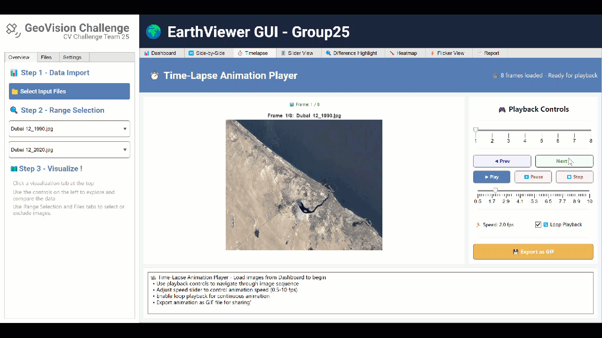

# TUM CV Challenge SoSe 2025 – GeoVision

## Description

This branch contains the submission code from **Team 25** for the **Satellite Image Comparison Challenge**, part of the **Computer Vision (EI70110)** course (SoSe 2025) offered by the Chair of Data Processing at the **Technical University of Munich**.

## Getting Started

### 1. Clone the Repository

```bash
git clone -b gui-playground https://github.com/NoMoreNameToUse/tum-cv-challenge-2025.git
```

### 2. Running the GUI
 
* Open run_cv_app.m in MATLAB.
* Run the script. The GUI should launch shortly.

The GUI should work on both windows and macos and is tested to work from version MATLAB R2024b upwards

## GUI Feature Overview


Main view of the GUI, displaying all the necessary information

### Basic Functions


First, import your dataset by selecting its folder, and wait for the GUI to finish processing the dataset.


Second, select the part of your dataset to be analyzed by either using the range selection or the file tree in the sidebar.

You can preview the original, aligned or cropped images by using the preview settings, and switch between images by using the dropdown, quick select or filetree. 

After this, you can start to visualize the change by selecting a visualization method from the top selection tabs. 

### Sidebar Functions 


Filetree tab: You can include / exclude images from the dataset or switch dataset here. It can also be used as quick navigation for previewing.


Settings for the GUI. Self explanatory.
## Visualization Feature Demos 

### Dashboard 


Use the preview quick select slider to preview the proccessed dataset

### Side By Side View


Zoom and pan to compare individual detail of two images

### Timelapse View


Timelapse to visualize changes over time

### Slider View


Slider to better compare differences between two images

### Difference Highlight


Highlight the differences between images, including increased and decreased area

### Heatmap


Use heatmap and superimposed heatmap to visualize the speed of change and intensity of change

### Flicker View


Flicker view allows you to better visualize the changes with the exact changes outlined 

## Documentation
Detailed documentation could be found in [[Our Documentation Wiki](docs/README.md)]

## Changelog
Initial upload GUI V0.1:
* Basic GUI functionality including dataset select, multiple dataset import and dataset switching

GUI V0.2: 
Code cleanup and bug fixes:
* Updated the preprocessImageSequence.m implementation from martin to the newest version
* Dataset name now shown alongside image file names due to new dataset naming convention
* Cleaned up some internal copy pasta variable and GUI update sequence

GUI V0.3: 
Achieved feature parity with Kai's Revamped GUI and implemented new features:
* Implemented slider view from Kai's GUI Revamp with original code from Rongfei
* Implemented side by side view from Kai's GUI Revamp with original code from Rongfei
* Implemented timelapse view from Kai's GUI Revamp with original code from Rongfei
* Implemented difference highlight view from Kai's GUI Revamp with updated code from Zihan
* Implemented heatmap view from Kai's GUI Revamp with updated code from Zihan
* Implemented flicker view from Kai's GUI Revamp with updated code from Zihan

GUI V1.0: 
All function implemented and bugs fixed. Ready for final review and submission:
* Fixed GUI - Slider Bug: Slider not working after zoom / pan in Side by Side view
* Fixed Timelapse Image Name Formatting Issue
* Fixed Side by Side view sync button not working bug
* Fixed UI Update Sequence inconsistency issue 
* Added Program State Indicator for program state indication
* Added Alternative preprocessing feature and its corresponding selection box
